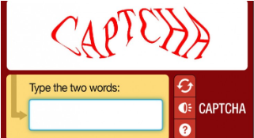
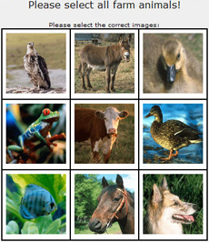
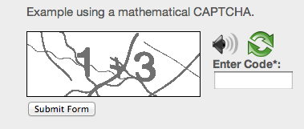

# CAPTCHAs para Educação Ambiental

Exemplos de CAPTCHAs com temática ambiental em Javascript

## Possíveis CAPTCHA's:

## Tirados do [8 Widely Used Captcha's Examples](https://www.letsnurture.com/blog/8-widely-used-captcha-examples.html)

### Padrão com palavras distorcidas:

<b>Como funciona:</b> Esse é o captcha padrão disponível sempre que um check-in de segurança é necessário, no qual você precisa escrever a palavra que foi exibida. Mas algumas das imagens distorcidas das palavras são difíceis de resolver. Para obter essa passagem, você pode usar a opção "Recaptcha", a fim de receber uma nova. Há também uma opção de áudio se você não conseguir distinguir visualmente a palavra. Estes são os mais usados ​​ao preparar um formulário no desenvolvimento de sites ou no desenvolvimento de aplicativos.

<b>Como podemos usar:</b> Exatamente do mesmo formato, porém com palavras ou pequenas expressões de conscientização ambiental, como "preservacao da vida", "recicle", "conserve", "sustentabilidade" etc.

### Identificação de Figuras

<b>Como funciona:</b> Esse captcha fornece aos usuários a opção elementar de selecionar a imagem correta que eles precisam identificar. Esse tipo de captcha geralmente nunca fica mais difícil do que as imagens básicas; portanto, você não precisa se preocupar com o fato de seus usuários não conseguirem descrevê-las.

<b>Como podemos usar:</b> De forma parecida, porém com imagens de impacto, como por exemplo "Selecione as tartarugas felizes:" e mostrar imagens de tartarugas em seu habitat natural e tambem tartarugas com lesões ou maltratos pela poluição, etc.

### Soluções Matemáticas

<b>Como funciona:</b> Esse tipo de captcha envolve problemas matemáticos básicos e, se o usuário não conseguir resolver essas questões básicas, provavelmente você não deseja que ele visite seu site ainda mais. Isso fornece números fáceis de ler e deve ser resolvido para passar pelo captcha.

<b>Como podemos usar:</b> Pode-se manter soluções matemáticas porém com temas ambientais, por exemplo "colocar exemplo aqui".

### Captcha com Propaganda

<b>Como funciona:</b> Esse tipo de captcha ajuda seus sites a ganhar algum dinheiro extra publicando-o, o que também ajuda em termos de reconhecimento de marca.

<b>Como podemos usar:</b> Sem fins lucrativos, fazer propaganda de ONGs e empresas que lutam pela defesa, preservação e recuperação do meio ambiente.
